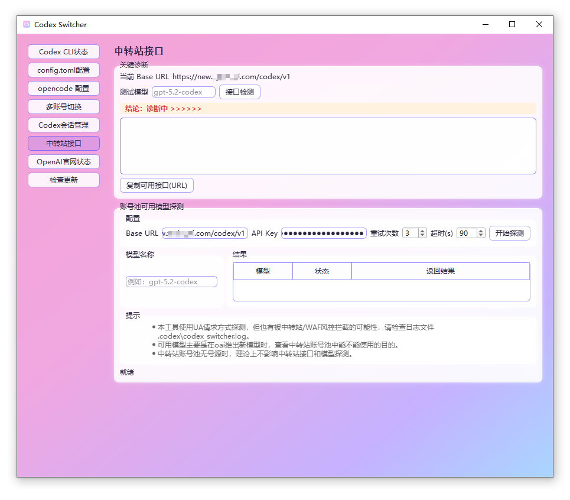

# CodexSwitcher

## 界面截图

## 完整功能
- **Codex CLI 生态配置**：检测本机 codex 路径/版本，并提供 config.toml 与 opencode 配置管理
- **多账号切换**：管理多个账号/密钥/中转站地址，一键切换生效
- **中转站接口诊断**：检测 Base URL 连通性、接口可用性、模型/embedding/moderation 探测
- **Codex 会话管理**：
  - 会话索引：显示时间、目录、模型、分支等
  - 详情查看：按角色分隔展示对话内容
  - 高级检索：OR/AND、多关键词、history 优先 + 深度搜索、进度与取消
  - 导出：JSON / Markdown
  - 清理：按日期/大小批量清理
  - 右键：打开会话文件夹、继续该会话（Codex CLI）
- **OpenAI 官网状态**：同步展示 status.openai.com 组件状态，并按异常类型着色

## 使用说明
- 双击运行 `CodexSwitcher_v2.exe`
- 在「多账号切换」中添加/管理账号
- 在「中转站接口」中进行接口与模型可用性检测
- 在「Codex会话管理」中进行本地所有历史会话检索、查看、一键Codex CLI继续该会话、导出归档到JSON / Markdown、清理会话

## 依赖与第三方许可
本项目为桌面版（Windows）打包发布，核心依赖包含：
- PySide6（Qt for Python）
- qt-material
- requests
- pillow
- pyinstaller（用于打包）

以上依赖均由其各自许可证约束。发布可执行文件时，建议在 Release 说明中保留第三方许可提示。
