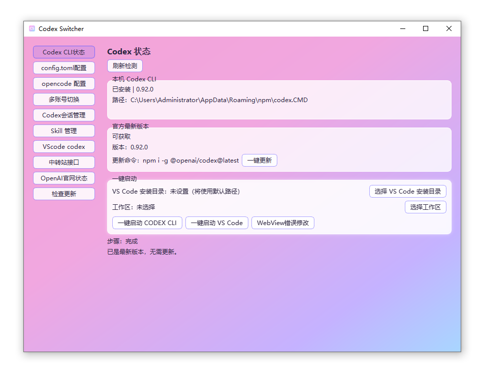

# CodexSwitcher

## 界面截图

## 完整功能
- **Codex CLI 状态页**：移除“诊断信息”；新增一键更新、一键启动 Codex CLI / VS Code、一键修复常见 WebView 视图错误
- **Codex CLI 生态配置**：检测本机 codex 路径/版本，并提供 config.toml 与 opencode 配置管理
- **多账号切换**：管理多个账号/密钥/中转站地址，一键切换生效
- **Codex 会话管理**：索引/详情/高级检索/导出/清理；右键打开文件夹、继续 CLI 会话、VS Code 打开会话目录、WebView 修复
- **Skill 管理**：支持扫描识别本地 Codex skill，查看、导入、备份、删除
- **VS Code 插件增强**：支持一键增加 OAI 新模型，免去手动修改 DEFAULT_MODEL_ORDER
- **中转站接口诊断**：连通性、接口可用性、模型/embedding/moderation 探测
- **OpenAI 官网状态**：同步展示 status.openai.com 组件状态并分类着色
## 使用说明
- 双击运行 `CodexSwitcher_v2.exe`
- 在「多账号切换」中添加/管理账号
- 在「中转站接口」中进行接口与模型可用性检测
- 在「Codex会话管理」中进行本地所有历史会话检索、查看、一键Codex CLI继续该会话、导出归档到JSON / Markdown、清理会话

## 依赖与第三方许可
本项目为桌面版（Windows）打包发布，核心依赖包含：
- PySide6（Qt for Python）
- qt-material
- requests
- pillow
- pyinstaller（用于打包）

以上依赖均由其各自许可证约束。发布可执行文件时，建议在 Release 说明中保留第三方许可提示。
